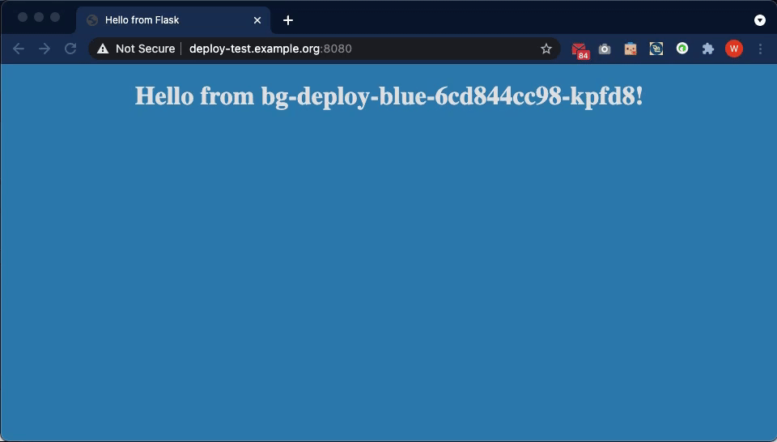
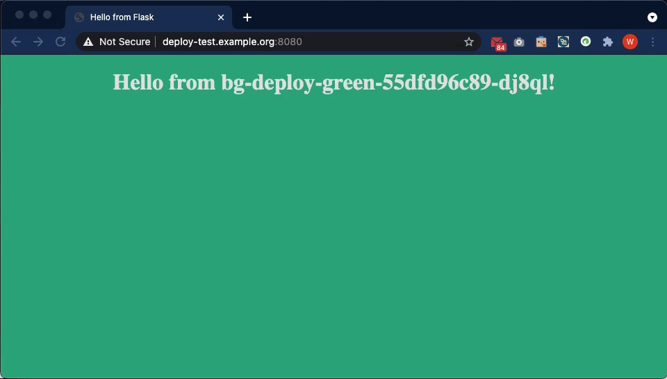

# Blue-Green Deployment using Helm Charts on Kubernetes

## Installation
### Prerequisites

* Install Helm3
```
$ curl https://raw.githubusercontent.com/helm/helm/master/scripts/get-helm-3 > get_helm.sh
$ chmod 700 get_helm.sh
$ ./get_helm.sh
```

* Install Istio
```
$ wget https://github.com/istio/istio/releases/download/1.9.3/istio-1.9.3-osx.tar.gz
$ tar zxvf istio-1.9.3-osx.tar.gz
$ cd istio-1.9.3
$ helm install istio-base manifests/charts/base -n istio-system
$ helm install istiod manifests/charts/istio-control/istio-discovery -n istio-system
$ helm install istio-ingress manifests/charts/gateways/istio-ingress -n istio-system
```

* Create new namespace - my-app
```
$ kubectl create namespace my-app
```

* Add label for Istio auto injection
```
$ kubectl label namespace my-app istio.io/rev=1-9-3
```

* Config default namespace to my-app
```
$ kubectl config set-context --current --namespace my-app
```
### Running for blue-green deployment

* Change directory to the root folder of blue-green helm chart
```
$ cd blue-green
```

* The first time deploy the blue and green deployment with the version "1.0" for both slots by the Helm install command and than switch traffic to blue
```
$ helm install deploy-test . --namespace=my-app --set blue.enabled=true --set blue.timestamp="$(date '+%Y-%m-%d %H:%M:%S')" --set blue.appVersion="1.0" --set green.timestamp="$(date '+%Y-%m-%d %H:%M:%S')" --set green.appVersion="1.0" --set productionSlot=blue --debug
``` 

* Deploy the green deployment with the new version "xx.xx"  by the Helm upgrade command
```
# You can define new version for this release to replace "xx.xx"
$ ./deployBlueOrGreen.sh green xx.xx
```

* Checkout rolling update status is ready
```
$ kubectl rollout status deployments/bg-deploy-green -n my-app
deployment "deploy-test-my-app-green" successfully rolled out
```

* Switch the traffic to green 
```
$ ./switchTraffic.sh green
```

* Repeat the steps for upgrading the blue deployment with new version again
```
# You can define new version for this release to replace "xx.xx"
$ ./deployBlueOrGreen.sh blue xx.xx
$ kubectl rollout status deployments/bg-deploy-blue -n my-app
$ ./moveTraffic.sh blue
```

### Running for automatic blue-green deployment
* Port forward to the Istio ingress controller
```
kubectl port-forward $(kubectl get pods --selector=istio=ingressgateway -n istio-system --no-headers -o custom-columns=NAME:.metadata.name) 8080:8080
```
* Add a record into your `/etc/hosts`
```
127.0.0.1	deploy-test.example.org
```
* Open your web browser and open the url with `http://deploy-test.example.org:8080`
* You can monitor automatic blue-green deployment by the following command:
```
# You can define new version for this release to replace "xx.xx"
$ ./autoDeployBlueOrGreen.sh xx.xx
```
* Monitor the website changes

